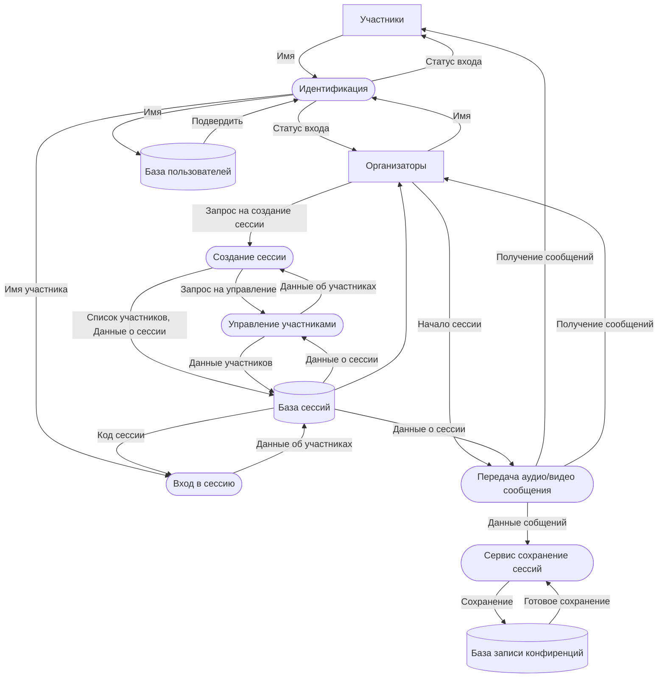

# DFD — Диаграмма потоков данных (система видеоконференций)

## Диаграмма

## Элементы диаграммы

| Тип              | Название                       |
| ---------------- | ------------------------------ |
| Внешняя сущность | Участники                      |
| Внешняя сущность | Организаторы                   |
| Процесс          | Идентификация                  |
| Процесс          | Создание сессии                |
| Процесс          | Управление участниками         |
| Процесс          | Вход в сессию                  |
| Процесс          | Передача аудио/видео сообщения |
| Процесс          | Сервис сохранение сессий       |
| Хранилище данных | База пользователей             |
| Хранилище данных | База сессий                    |
| Хранилище данных | База записи конфиренций        |

Рассчет:
1 видео 4
Чтение 1 и Запсиь 1
Для 100 человек: 600
Для 200: 1200
Для 500: 3000
