# DFD-модель упрощённой копии Twitter

Документ содержит набор диаграмм потоков данных (DFD) в текстовой нотации Mermaid и
сопроводительные спецификации: словарь потоков, каталог хранилищ и проверку балансировки
диаграмм.

## 1. Что моделируется

Упрощённая копия Twitter — микросервисная система соцсети со следующим функциональным
набором (всё, чего нет в этом перечне, сознательно вынесено за границы системы):

| Функция | Наличие в упрощённой копии |
|:--|:--|
| Регистрация, вход, выход, сессии | да |
| Профиль пользователя (аватар, описание, имя) | да |
| Публикация поста до 280 символов | да |
| Ответы (reply) и репосты (retweet) | да |
| Лайки | да |
| Подписки и отписки, социальный граф | да |
| Изображения к постам | да |
| Видео, аудио, трансляции | нет |
| Прямые сообщения, группы, Spaces | нет |
| Реклама, монетизация, promotion | нет |
| Аналитика и рекомендательные ленты | нет |
| Сторис, опросы, клипы | нет |

Границы системы показаны на контекстной диаграмме: всё, что находится вне прямоугольника
«Упрощённый Twitter», — внешние сущности.

## 2. Нотация

Диаграммы построены в нотации DFD (Gane–Sellar) и отрисованы средствами Mermaid.
Соответствие элементов нотации и элементов Mermaid:

| Элемент нотации DFD | Смысл | Запись в Mermaid | Форма | Цвет |
|:--|:--|:--|:--|:--|
| Внешняя сущность (E) | Источник или получатель данных вне системы | `E1["Пользователь"]` | прямоугольник | жёлтый |
| Процесс (P) | Преобразование потоков данных | `P1("1. Публикация")` | скруглённый прямоугольник | голубой |
| Хранилище данных (D) | Данные, которые хранятся между запусками системы | `D1[("D1. Посты")]` | цилиндр | зелёный |
| Соседний процесс (S) | Взаимодействие с другим процессом по его внешнему интерфейсу | `S1["CF-01 Лента"]` | прямоугольник | фиолетовый |
| Поток данных | Данные, передаваемые между элементами | `A -->|имя| B` | стрелка с подписью | — |
| Поток, минующий хранилище | Чтение напрямую из кэша, без похода в базу | `A -.->|имя| B` | пунктирная стрелка | — |

Нумерация процессов соответствует уровням декомпозиции: `1` — процесс уровня 0,
`1.2` — процесс внутри `1`. Хранилища нумеруются сквозным образом: `D1`, `D2`, …

Внешние потоки получают номера `CF-01` … `CF-14`; они одинаковы на всех уровнях и
составляют основу проверки балансировки (раздел 16).

Диаграммы вставлены как блоки ` ```mermaid ` и отрисовываются без дополнительных
инструментов на GitHub и GitLab. Локально их можно посмотреть в режиме предпросмотра
Markdown в VS Code, в IntelliJ IDEA или командой `npx -p @mermaid-js/mermaid-cli mmdc -i d.md -o d.svg`.

## 3. Диаграмма 1. Контекстная диаграмма (уровень −1)

Система показана как один чёрный ящик: видны только внешние сущности и границы потоков.

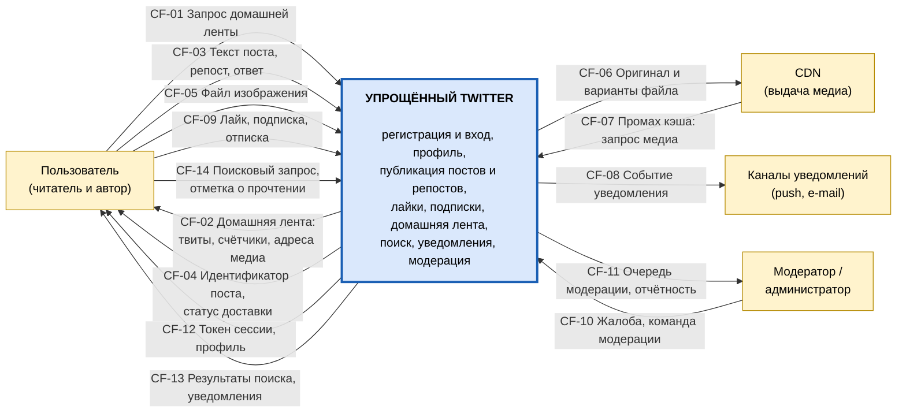

## 4. Диаграмма 2. Декомпозиция системы (уровень 0)

Семь процессов. Каждый процесс далее раскрывается на отдельной диаграмме.

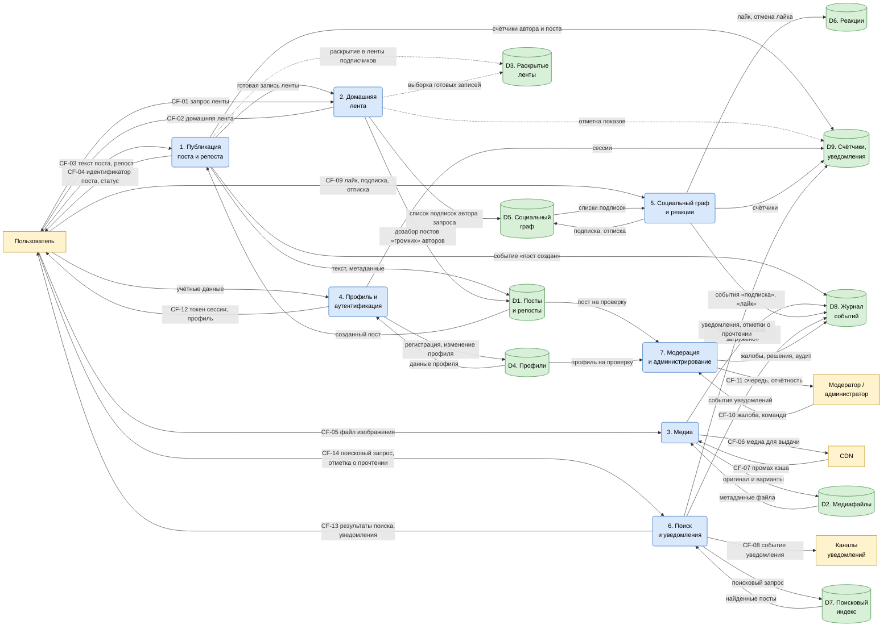

## 5. Диаграмма 3. Декомпозиция процесса «1. Публикация поста и репоста»

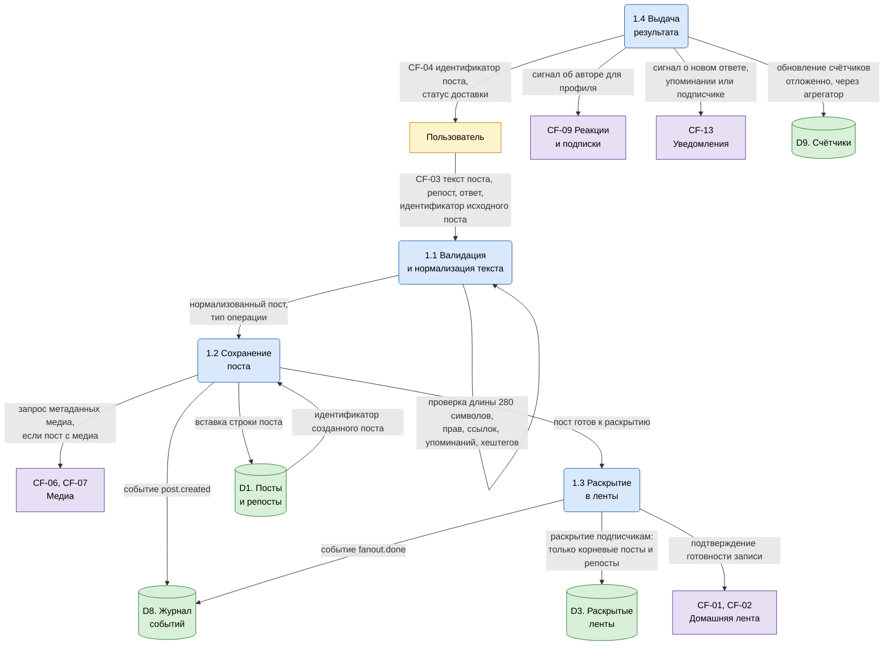

## 6. Диаграмма 4. Декомпозиция процесса «2. Домашняя лента»

Лента собирается гибридно: заранее раскрытые записи берутся из кэша, а посты «громких»
авторов дозабираются из хранилища при чтении.

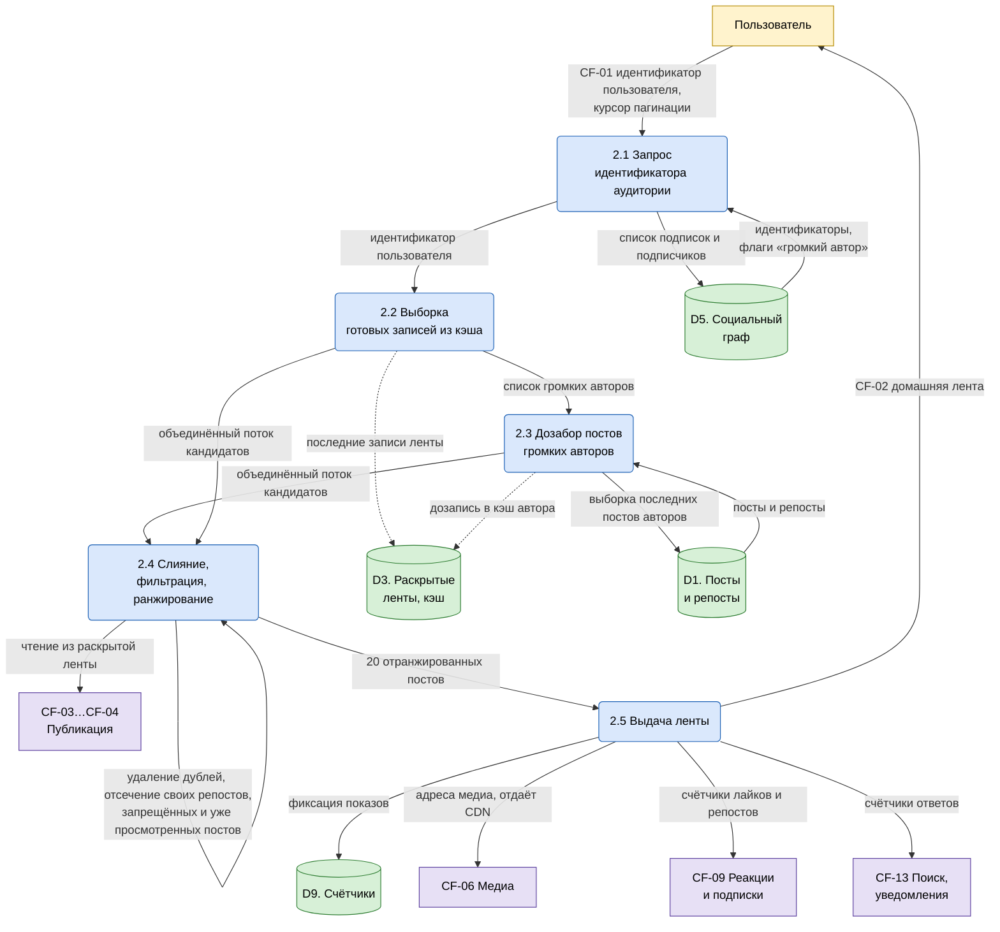

## 7. Диаграмма 5. Декомпозиция процесса «3. Медиа»

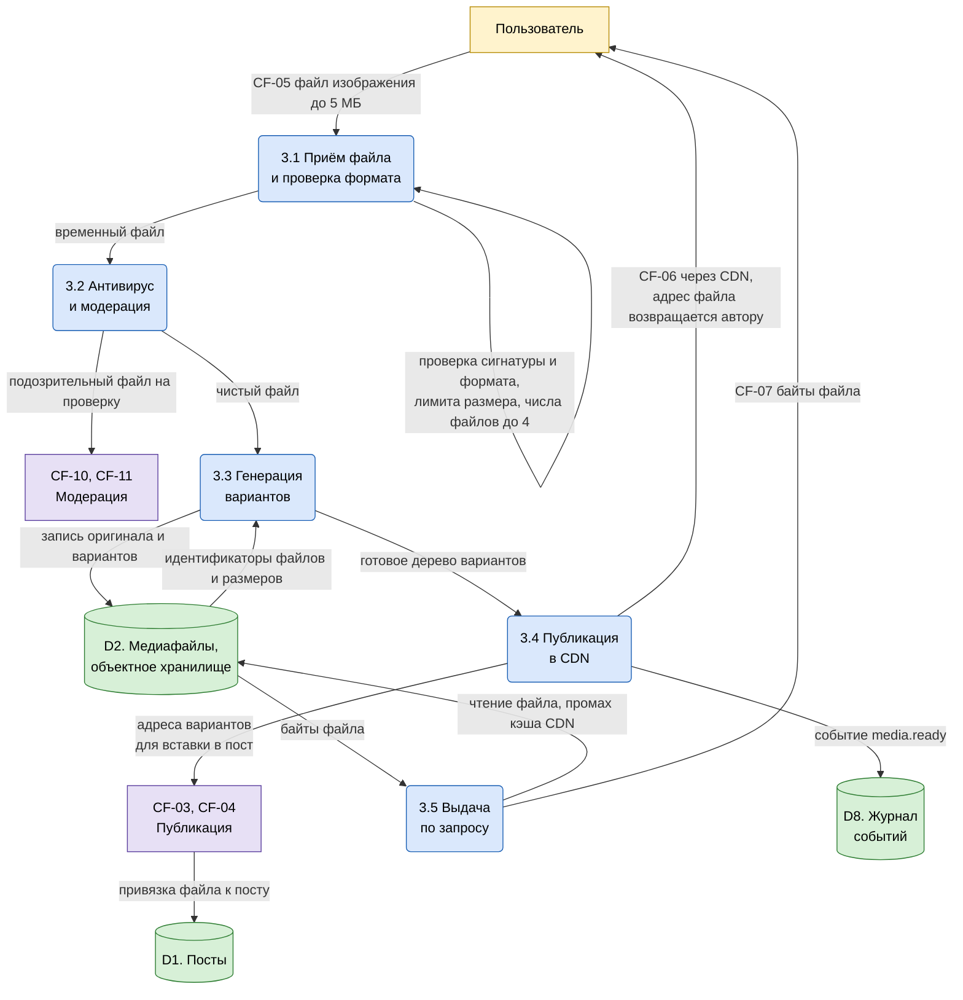

## 8. Диаграмма 6. Декомпозиция процесса «4. Профиль и аутентификация»

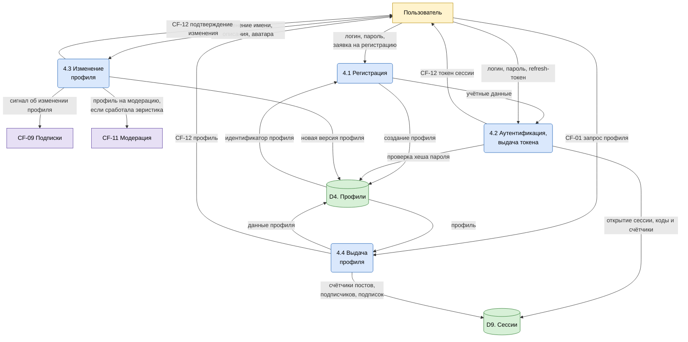

## 9. Диаграмма 7. Декомпозиция процесса «5. Социальный граф и реакции»

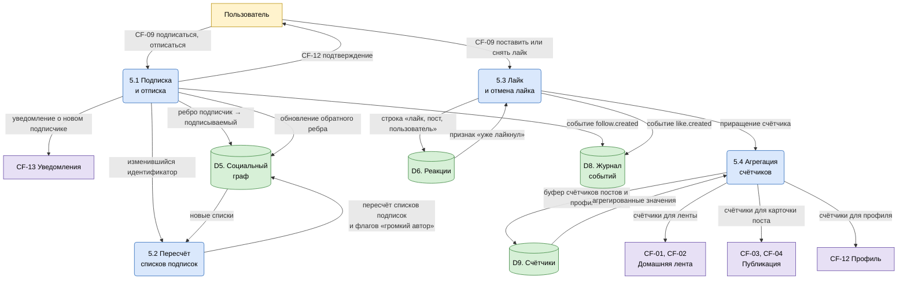

## 10. Диаграмма 8. Декомпозиция процесса «6. Поиск и уведомления»

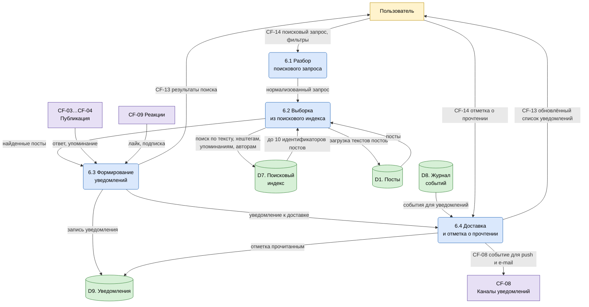

## 11. Диаграмма 9. Декомпозиция процесса «7. Модерация и администрирование»

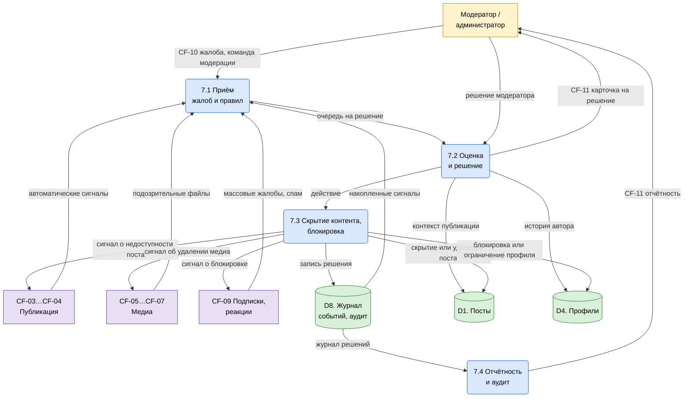

## 12. Диаграмма 10. Компонентная диаграмма (UML)

DFD показывает потоки данных, но не говорит, как система развёрнута. Этот раздел —
архитектурная проекция той же модели в терминах UML: компоненты, хранилища и границы
развёртывания. Нумерация компонентов совпадает с нумерацией процессов DFD.

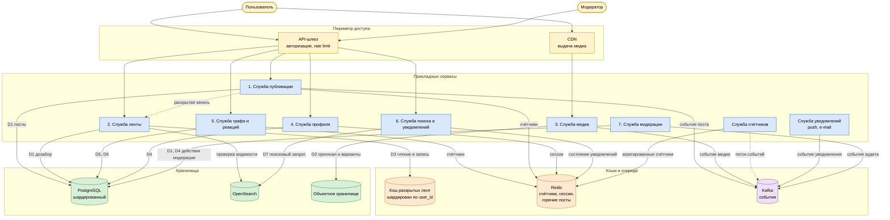

Гибридная раскрывка ленты зафиксирована на компонентной диаграмме: служба ленты читает
кэш раскрытых записей `FC` и дозабирает посты «громких» авторов из `PG`, а служба
публикации `CPO` только раскрывает запись при записи и публикует событие в `KFK`.

## 13. Диаграмма 11. Диаграмма последовательности публикации поста (UML)

Показывает, как процесс 1 декомпозируется во времени и где возникает асинхронность —
это объясняет, почему в расчёте нагрузки отдельно учитываются пиковая интенсивность
записи и объём фоновой раскрывки.

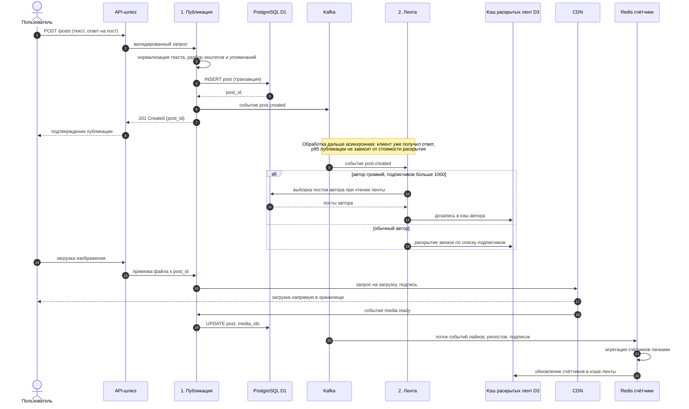

## 14. Словарь потоков данных

### 14.1 Внешние потоки

| ID | Источник → Приёмник | Поток | Структура | Примерный объём |
|:--|:--|:--|:--|:--|
| CF-01 | Пользователь → Система | Запрос домашней ленты | `user_id`, курсор, `limit` | 1,5 КБ |
| CF-02 | Система → Пользователь | Домашняя лента | 20 объектов постов и счётчики | ~16 КБ |
| CF-03 | Пользователь → Система | Текст поста, репост, ответ | текст до 280 симв., `in_reply_to`, `retweet_of` | 0,5–1 КБ |
| CF-04 | Система → Пользователь | Идентификатор поста, статус | `post_id`, `created_at`, статус доставки | 0,3 КБ |
| CF-05 | Пользователь → Система | Файл изображения | JPEG или PNG до 5 МБ, до 4 файлов | 1,6 МБ в среднем |
| CF-06 | Система → CDN | Оригинал и варианты файла | метаданные и байты файла | ~2,6 МБ на файл |
| CF-07 | CDN → Система | Промах кэша: запрос медиа | `file_id`, параметры варианта | 0,2 КБ |
| CF-08 | Система → Кананы уведомлений | Событие уведомления | тип, `user_id`, payload | 1 КБ |
| CF-09 | Пользователь → Система | Лайк, подписка, отписка | `post_id` или `target_user_id`, действие | 0,2 КБ |
| CF-10 | Модератор → Система | Жалоба, команда модерации | объект жалобы, тип действия | 1 КБ |
| CF-11 | Система → Модератор | Очередь модерации, отчётность | карточка объекта, счётчики жалоб | 2 КБ |
| CF-12 | Система → Пользователь | Токен сессии, профиль | JWT, профиль, счётчики | 1–2 КБ |
| CF-13 | Система → Пользователь | Результаты поиска, уведомления | до 10 постов, список уведомлений | 5–10 КБ |
| CF-14 | Пользователь → Система | Поисковый запрос, отметка о прочтении | строка запроса, фильтры, `notification_id` | 0,3 КБ |

### 14.2 Внутренние потоки уровня 0

| ID | Источник → Приёмник | Поток |
|:--|:--|:--|
| IF-01 | 1. Публикация → 2. Лента | готовая запись раскрытой ленты |
| IF-02 | 3. Медиа → 1. Публикация | метаданные и адреса вариантов файла |
| IF-03 | 5. Граф и реакции → 2. Лента | счётчики лайков и репостов |
| IF-04 | 6. Поиск и уведомления → 2. Лента | счётчики ответов |
| IF-05 | 2. Лента → 3. Медиа | адреса медиа, выдачу делает CDN |
| IF-06 | 2. Лента → 6. Поиск и уведомления | признак «показан уведомляемому» |
| IF-07 | 5. Граф и реакции → 6. Поиск и уведомления | события лайка и подписки |
| IF-08 | 1. Публикация → 6. Поиск и уведомления | сигнал об ответе и упоминании |
| IF-09 | 1. Публикация → 5. Граф и реакции | сигнал об авторе для счётчиков профиля |
| IF-10 | 7. Модерация → 1, 3, 5 | сигналы о скрытии поста, удалении медиа, блокировке |

### 14.3 Потоки, минующие хранилище (пунктир)

| ID | Что читается напрямую из кэша | Почему так |
|:--|:--|:--|
| IF-11 | 2. Лента → D3, готовая запись | 98 % чтений ленты обслуживается кэшем раскрытия, поход в базу поднял бы p95 в десятки раз |
| IF-12 | 2. Лента → D3, дозапись | «громкие» авторы пишут в кэш при первом же чтении |
| IF-13 | 2. Лента → D9, фиксация показов | поток показов асинхронный и не блокирует выдачу |
| IF-14 | 1. Публикация → D3, раскрытие | раскрытие выполняется потребителем событий, а не в транзакции поста |

## 15. Каталог хранилищ

| ID | Хранилище | Технология | Что хранит | Срок хранения |
|:--|:--|:--|:--|:--|
| D1 | Посты и репосты | PostgreSQL, шардированный по `user_id` | текст, автор, время, счётчики-ссылки, привязка медиа | 10 лет |
| D2 | Медиафайлы | Объектное хранилище с репликацией | оригинал и варианты доставки | 365 дней |
| D3 | Раскрытые ленты | Кэш в оперативной памяти, шардирован по `user_id` | готовые записи лент подписчиков | 7 дней по времени добавления |
| D4 | Профили | PostgreSQL | имя, описание, аватар, хеш пароля, статус | бессрочно |
| D5 | Социальный граф | PostgreSQL, отдельные таблицы-списки | рёбра «подписчик → подписываемый», флаги «громкий автор» | бессрочно, чистка неактивных |
| D6 | Реакции | PostgreSQL, таблица `(post_id, user_id)` | лайки | 3 года |
| D7 | Поисковый индекс | OpenSearch | текст постов, хештеги, упоминания, автор | 365 дней |
| D8 | Журнал событий | Kafka и объектное хранилище для холодного архива | события публикаций, лайков, подписок, аудит модерации | 7 дней горячих, 90 дней холодных |
| D9 | Счётчики, сессии, уведомления | Redis | счётчики постов и профилей, сессии, лента уведомлений | по событию |

## 16. Балансировка диаграмм

Правило балансировки: каждый поток данных родительской диаграммы должен появиться на
дочерней без изменения, а на дочерней не должно быть потоков, отсутствующих на родителе.

Таблица сопоставления внешних потоков контекстной диаграммы и уровня 0:

| Поток | Уровень −1 | Уровень 0, процесс-источник или приёмник | Появляется в декомпозиции |
|:--|:--|:--|:--|
| CF-01 | Пользователь → Система | E1 → 2. Домашняя лента | диаграмма 4 |
| CF-02 | Система → Пользователь | 2. Домашняя лента → E1 | диаграмма 4 |
| CF-03 | Пользователь → Система | E1 → 1. Публикация | диаграмма 3 |
| CF-04 | Система → Пользователь | 1. Публикация → E1 | диаграмма 3 |
| CF-05 | Пользователь → Система | E1 → 3. Медиа | диаграмма 5 |
| CF-06 | Система → CDN | 3. Медиа → E3 | диаграмма 5 |
| CF-07 | CDN → Система | E3 → 3. Медиа | диаграмма 5 |
| CF-08 | Система → Кананы уведомлений | 6. Поиск и уведомления → E4 | диаграмма 8 |
| CF-09 | Пользователь → Система | E1 → 5. Граф и реакции | диаграмма 7 |
| CF-10 | Модератор → Система | E2 → 7. Модерация | диаграмма 9 |
| CF-11 | Система → Модератор | 7. Модерация → E2 | диаграмма 9 |
| CF-12 | Система → Пользователь | 4. Профиль → E1 | диаграмма 6 |
| CF-13 | Система → Пользователь | 6. Поиск и уведомления → E1 | диаграмма 8 |
| CF-14 | Пользователь → Система | E1 → 6. Поиск и уведомления | диаграмма 8 |

Дополнительно на уровне 0 введены внутренние потоки IF-01 … IF-10 и обходные потоки
IF-11 … IF-14 — они появляются только при декомпозиции и на родительской диаграмме
отсутствуют, что допустимо и является признаком корректной модели: дочерняя диаграмма
уточняет внутреннее устройство процесса.

## 17. Связь с расчётом нагрузки

Каждый элемент этой модели имеет числовой вес в [расчёте нагрузки](capacity.md):

| Элемент модели | Где считается |
|:--|:--|
| Внешние потоки CF-01 … CF-14 | число операций API в сутки |
| D1, D4, D5, D6 | объём постоянного хранилища и число записей в PostgreSQL |
| D2 | объём объектного хранилища и исходящий трафик |
| D3 | объём кэша в оперативной памяти и число операций записи и чтения |
| D7 | объём и число шардов поискового индекса |
| D8 | число событий и объём Kafka |
| Процесс 2, лента | операции слияния и раскрытия — главный потребитель CPU и RAM |
| Процесс 3, медиа | входящий и исходящий трафик, число файлов |
